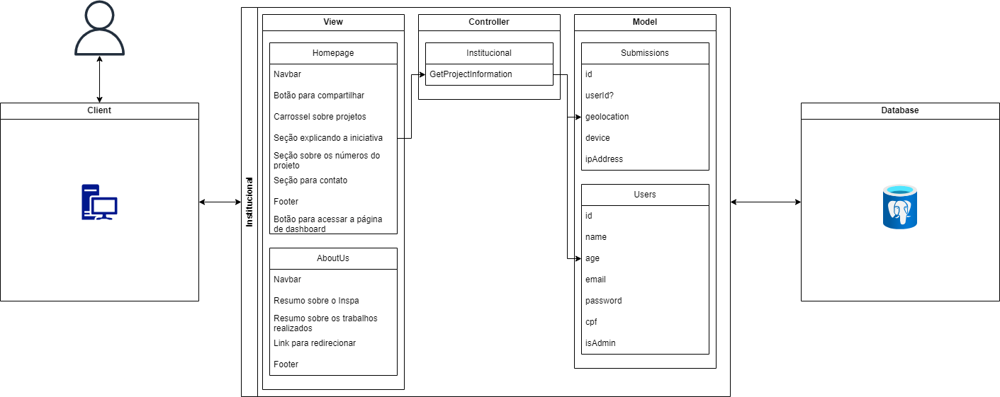

# WAD - Web Application Document - Módulo 2 - Inteli

**_Os trechos em itálico servem apenas como guia para o preenchimento da seção. Por esse motivo, não devem fazer parte da documentação final_**

## Grupo 2: WatchDogs

#### Nomes dos integrantes do grupo:

- Ana Eloisa Façanha
- Bruno Jancso Fabiani
- Davi Basã
- Gustavo Gonçalves da Costa
- Isadora Tribst Gatto
- Lucas Matheus Nunes
- Vinicius Testa Passos

## Sumário

[1. Introdução](#c1)

[2. Visão Geral da Aplicação Web](#c2)

[3. Projeto Técnico da Aplicação Web](#c3)

[4. Desenvolvimento da Aplicação Web](#c4)

[5. Testes da Aplicação Web](#c5)

[6. Conclusões e trabalhos futuros](#c6)

[7. Referências](#c7)

[Anexos](#c8)

<br>


# Introdução (sprints 1 a 5)

&nbsp;&nbsp;&nbsp;&nbsp;A problemática trazida pelo parceiro de projeto, o INSPA, é a falta de trabalhos científicos abrangentes que abordem o abandono animal de forma global, considerando fatores do comportamento humano, percepções dos animais e aspectos socioculturais envolvidos na adoção, compra e abandono de animais de estimação. A condição atual mostra uma visão parcial e estática do cenário, sem consolidar todos os fatores implicados.<br>
&nbsp;&nbsp;&nbsp;&nbsp;A solução desenvolvida é uma aplicação web responsiva para coletar informações sobre o comportamento de tutores em relação à adoção, compra e abandono de cães e gatos. Essa ferramenta visa consolidar uma base de dados ampla, confiável e ordenada, permitindo que a equipe científica do INSPA e o Dr. Pet, Alexandre Rossi, apliquem questionários diretamente aos tutores para obter insights valiosos.<br>
&nbsp;&nbsp;&nbsp;&nbsp;Os aspectos essenciais para a criação de valor do produto incluem a capacidade de coletar dados em larga escala, proporcionando uma compreensão mais profunda dos motivos por trás do comportamento de adoção e abandono de animais. Isso permite que o INSPA e seus parceiros desenvolvam ações privadas e públicas para controlar e reduzir o problema do abandono animal, contribuindo para a melhoria do bem-estar dos animais de estimação e a redução de negligência e maus-tratos.

# Visão Geral da Aplicação Web (sprint 1)

## 2.1. Escopo do Projeto (sprint 1)

### 2.1.1. Contexto da indústria (sprint 1)

&nbsp;&nbsp;&nbsp;&nbsp;O INSPA - Instituto de Saúde e Psicologia Animal opera em um mercado PET brasileiro que, em 2023, registrou um faturamento impressionante de R$ 67,4 bilhões, evidenciando um crescimento de 14% em relação ao ano anterior. Este mercado vibrante reflete a paixão nacional pelos animais de estimação, com o Brasil mantendo sua posição como o terceiro maior mercado global do segmento.
<br>
&nbsp;&nbsp;&nbsp;&nbsp;Dentro deste contexto próspero, o INSPA se destaca não apenas por oferecer cursos de pós-graduação, cursos livres, programas educacionais e iniciativas de pesquisa na área de bem-estar animal e comportamento animal, mas também por sua metodologia inovadora. A instituição adota uma abordagem interdisciplinar que integra psicologia, saúde animal e técnicas de ensino avançadas, diferenciando-se significativamente de concorrentes como a Faculdade Qualittas e a Anhembi Morumbi, que, apesar de também oferecerem cursos similares, não possuem o mesmo enfoque interdisciplinar e aplicado.<br>
&nbsp;&nbsp;&nbsp;&nbsp;A capacidade do INSPA de gerar receita é amplificada pela sua oferta única de cursos especializados que atendem à crescente demanda por profissionais qualificados em um campo que evolui rapidamente. Estes programas são projetados para equipar os alunos com habilidades práticas e teóricas necessárias para enfrentar desafios complexos relacionados ao comportamento animal e ao cuidado com os pets.<br>
&nbsp;&nbsp;&nbsp;&nbsp;Além disso, o INSPA contribui para a conscientização pública sobre a importância do vínculo humano-animal e na prevenção de problemas como abandono e maus-tratos. Essas iniciativas não apenas fortalecem a reputação da instituição, mas também podem gerar receita indireta por meio de parcerias estratégicas, patrocínios e o apoio de organizações comprometidas com o bem-estar animal.<br>
&nbsp;&nbsp;&nbsp;&nbsp;Em um cenário onde a conscientização sobre o bem-estar dos animais de estimação e a relação entre humanos e animais está em ascensão, o INSPA se sobressai ao oferecer programas de pós-graduação que preparam profissionais para lidar com questões comportamentais e de cuidado animal de forma eficaz e ética. Suas iniciativas educacionais e de pesquisa promovem práticas mais éticas e responsáveis, contribuindo significativamente para o avanço da indústria.<br>
&nbsp;&nbsp;&nbsp;&nbsp;Em resumo, o INSPA está firmemente posicionado em um mercado dinâmico e em crescimento, desempenhando um papel crucial na formação de profissionais qualificados e na promoção de relações saudáveis entre humanos e animais de estimação. Seu compromisso com a educação, pesquisa e conscientização o estabelece como um líder inovador no campo do bem-estar animal e comportamento animal, impulsionando o progresso da indústria como um todo.
<br>

### 2.1.2. Modelo de 5 Forças de Porter (sprint 1)

&nbsp;&nbsp;&nbsp;&nbsp;Inicialmente, emprega-se o framework “5 Forças de Porter” para a análise do segmento ao qual o Instituto INSPA faz parte, instituições de ensino de psicologia e saúde animal. Nesse sentido, a partir da ferramenta criada por Michael Porter, renomado professor da Harvard Business School, é possível reconhecer as 5 principais “forças” que pressionam as empresas de um setor a reduzir a lucratividade. Desse modo, a seguir (Figura 1) estão dispostas as 5 Forças de Porter em forma de canvas.

<div align="center" width=100%>
<sup> Figura 1 - Modelo de 5 Forças de Porter.</sup>

<sub>Fonte: material produzido pelos autores(2024).</sub>
</div>
<br>


&nbsp;&nbsp;&nbsp;&nbsp;Ademais, caso necessário, de forma complementar, a descrição mais detalhada do canvas está disposta a seguir:<br>

#### **Ameaça de Novos Entrantes**

- **Obstáculos para novos entrantes:** A entrada neste setor requer expertise específica, infraestrutura adequada e aprovações regulatórias. Além disso, os custos relacionados à manutenção de mão de obra especializada e à produção de conteúdos que contemplem conhecimento de fronteira podem tornar o estágio inicial complexo para novos concorrentes.<br>

- **Impacto dos novos entrantes:** Com o aumento do interesse na psicologia e saúde animal, pode haver mais instituições entrando neste campo no futuro, o que poderia aumentar a concorrência para o INSPA, sobretudo, caso os novos entrantes busquem se diferenciar com pesquisadores de ponta.<br>

#### **Ameaça de Produtos ou Serviços Substitutos**

- **Produtos ou serviços substitutos:** Cursos online, seminários, workshops ou até mesmo aprendizado autodidata, via conteúdos disponibilizados gratuitamente na web, podem ser considerados substitutos. Além disso, academias de treinamento sobre comportamento animal, em formato presencial, também figuram como produtos alternativos.<br>

- **Nível de ameaça:** Embora existam substitutos, a natureza inovadora e a profundidade do conhecimento oferecido nos cursos de pós-graduação oferecidos pelo INSPA podem não ser facilmente substituídos, principalmente, ao se tratar de indivíduos que buscam uma especialização formal.<br>

#### **Poder de Barganha dos Fornecedores**

- **Principais fornecedores:** Os fornecedores neste contexto podem ser os professores e os profissionais que fornecem o conhecimento e a experiência para a construção dos produtos educacionais oferecidos pelo INSPA.<br>

- **Poder de barganha dos fornecedores:** O poder de barganha dos fornecedores pode ser considerado moderado, pois embora existam muitos profissionais qualificados no campo, a demanda por especialistas de alta qualidade é alta e, atualmente, o time pedagógico do Instituto contempla profissionais de destaque na área, como a Dra. Ceres Berger Faraco e o Dr. Alexandre Rossi, conhecido como  “Dr. Pet”.<br>

#### **Poder de Barganha dos Clientes**

- **Principais tipos de clientes:** Os principais clientes do INSPA são os estudantes interessados em psicologia e saúde animal.<br>

- **Poder de barganha dos clientes:** Os estudantes têm um poder de negociação razoável, pois podem escolher entre várias instituições de ensino. No entanto, a reputação e a qualidade do ensino do INSPA podem atrair muitos estudantes.<br>

#### **Rivalidade entre os Concorrentes Existentes**

- **Principais concorrentes:** Nesse momento, os concorrentes diretos do INSPA são outras instituições de ensino em psicologia e saúde animal, como também, academias de treinamento em manejo e cuidado de animais.<br>

- **Nível de rivalidade:** Nesse momento, é possível avaliar que o INSPA está em um oceano vermelho, ao concorrer com outras instituições de ensino, como o Instituto Qualittas, por exemplo, em formações educacionais formais de saúde animal. Dessa forma, compreende-se o nível de rivalidade como alto-moderado.<br>

&nbsp;&nbsp;&nbsp;&nbsp;Por fim, cabe analisar as forças que pressionam o setor, a fim de compreender de forma mais profunda o segmento em que o INSPA atua.<br>

### 2.1.3. Análise SWOT (sprint 1)

  &nbsp;&nbsp;&nbsp;&nbsp;A matriz SWOT é uma ferramenta amplamente usada para analisar situações em diferentes contextos, desde empresas até projetos pessoais. A sigla SWOT representa Forças, Fraquezas, Oportunidades e Ameaças. Ela ajuda a identificar os principais fatores internos e externos que afetam uma organização ou projeto. <br>
  &nbsp;&nbsp;&nbsp;&nbsp;Além disso, ao destacar esses elementos, a matriz SWOT permite uma avaliação completa e auxilia na formulação de estratégias para aproveitar vantagens, lidar com desafios e aproveitar oportunidades.<br> 
  &nbsp;&nbsp;&nbsp;&nbsp;Assim, usando esta matriz vamos analisar o INSPA para ter uma perpectiva ampla de como este opera dentro do mercado:

**Forças:**

- Presença forte em mídia social
  Devido a sua colaboração com Dr Pet, suas contas oficiais e o engajamento que animais trazem, a INSPA tem poder de influência em mídias sociais.
- Variedade de serviços oferecidos no mercado de educação:
  A INSPA tornou um campo disciplinar em um multidisciplinar aqui no Brasil, educando e produzido diversos profissionais nesta área além de atuar amplamente neste campo
- Boa reputação:
  Reconhecida por cliente pelos serviços de qualidade para pets com profissionais de qualidade. É uma organização excelente que atende um nicho bem fechado.

**Oportunidades:**
- Maior conscientização para a saúde do animal:
  A INSPA se beneficia com uma maior conscientização do bem estar do animal pois traz mais atenção ao seu campo de atuação e faz as pessoas buscarem mais seus serviços.
  Parcerias com instituições educacionais:
- Fazer parcerias com instituições educacionais traz maior reconhecimento para as pessoas que se interessam de seus serviços.
- Mercado(área de atuação) em constante expansão:
  A crescente taxa de adoção de animais traz ainda mais importância para seus trabalhos, já que mais animais irão precisar de seus serviços e estudos.

**Fraquezas :**
- Dependência de financiamento externo:
&nbsp;&nbsp;&nbsp;&nbsp;O INSPA depende de financiamento externo para operar, o que limita a sua operação e dificulta planejamentos para o futuro.

- Falta de diversificação de serviços:
  O INSPA atua em um mercado específico da educação e depende dos cursos de pós-graduação, produção de artigos de pesquisa e sua reputação para gerar renda, no entanto, o mercado PET é amplo.
- Dependência em tecnologia:
  Sempre tem que investir em tecnologia para se manter competitiva. O INSPA não é focado em tecnologia portanto não possui um banco de dados estruturado.

**Ameaças:**
- Eventos globais ou locais tirarem o foco para a causa animal:
  Eventos, tragédias e catastrófes enfraquecem a atenção do público para a causa animal. A mudança do foco da sociedade em relação a causa animal significa que o INSPA possa perder seu público.Entretanto, alguns eventos possam se tornar oportunidades.
- Regulamentação da Pós-graduação EAD:
  Governo pode inpor novas medidas em relação a cursos de pós-graduação EAD, que podem aumentar os custos, atualmente um tema em debate.
- Oceano Vermelho:
  Outros cursos e organizações podem tirar possíveis graduados que escolheriam o INSPA, como outros cursos de medicina e veterinário. Exemplos de cursos que disputam o mesmo consumidor da INSPA é a FMVZ USP, São Judas, CCVL academia, FAMESP, o Instituto Qualitas e marcas fortes da área de animal como a Cobasi/PETZ.

<br>

&nbsp;&nbsp;&nbsp;&nbsp;Após uma análise da matriz SWOT do INSPA, podemos concluir que a instituição possui forças sólidas, como presença forte nas mídias sociais e boa reputação. No entanto, enfrenta desafios como dependência de financiamento externo e concorrência no mercado. Para garantir sua competitividade, o INSPA deve diversificar seus serviços e buscar fontes alternativas de financiamento, enquanto se mantém atento às oportunidades emergentes e ameaças externas como outros cursos ou marcas grandes voltada aos animais.

### 2.1.4. Solução (sprints 1 a 5):

&nbsp;&nbsp;&nbsp;&nbsp;O problema da falta de dados suficientes e imparciais sobre as adoções, compras e abandonos de animais domésticos é uma realidade no cenário científico atual. A maioria dos estudos existentes apresenta uma visão enviesada do assunto e não cobre o assunto por completo. Para abordar essa questão, foi proposta uma solução que consiste em criar um website que apresente o Instituto de Defesa e Proteção Animal (Inspa) e sua proposta, além de disponibilizar um formulário para que o público em geral possa contribuir com a pesquisa sobre o assunto.

1. **Qual é o problema a ser resolvido?**

    &nbsp;&nbsp;&nbsp;&nbsp;O principal problema é o fato de que dentro do cenário científico hoje, não existem trabalhos científicos que apresentem dados suficientes sobre a situação e as causas/motivos por trás das adoções, compras ou abandonos de animais domésticos.<br>
    &nbsp;&nbsp;&nbsp;&nbsp;Além de que, os poucos estudos que existem, apresentam uma visão enviesada do assunto, além de não cobrir o assunto por completo.

2. **Quais os dados disponíveis? (fonte e conteúdo - exemplo: dados da área de Compras da empresa descrevendo seus fornecedores - se não houver, apenas indique "não se aplica")**

   1. TAPI - Termo de Adesão do Projeto Inteli: documento descrevendo o problema e destrinchando a solução
   2. Projeto State of Pet Homelessness: website que cria pesquisas e disponibiliza dados sobre a situação de animais em situação de rua.
   3. Projeto Abandono Zero: projeto que visa visitar instituições de ensino e promover eventos e palestras conscientizando as pessoas sobre a problemática do abandono de animais


3. **Qual a solução proposta?**

    &nbsp;&nbsp;&nbsp;&nbsp;A solução proposta consiste em criar um website, onde, a princípio, fala sobre o Inspa e seus objetivos, mas também terá a disponibilidade de um formulário para que o público em geral possa contribuir para a pesquisa sobre adoção, compra e abandono de animais.

4. **Como a solução proposta deverá ser utilizada?**

    &nbsp;&nbsp;&nbsp;&nbsp;A solução proposta deverá, além de apresentar o instituto e sua proposta para o público em geral, fazer perguntas e coletar dados através de um formulário, além de fazer uma análise e mostrar, de forma gráfica e numérica, os dados coletados.

5. **Quais os benefícios trazidos pela solução proposta?**

    &nbsp;&nbsp;&nbsp;&nbsp;A solução pode trazer clareza em relação a situação de animais adotados ou abandonados, além de que, os resultados da pesquisa podem ser utilizados para tomar ações mais efetivas visando diminuir os abandonos de animais e aumentar o número de adoções.

6. **Qual será o critério de sucesso e qual medida será utilizada para o avaliar?**

    &nbsp;&nbsp;&nbsp;&nbsp;Inicialmente, o seguinte quadro explicita o critério de sucesso e a sua respectiva métrica. 

<div align="center">
<sup>Quadro 1 - Critérios de sucesso e métricas de monitoramento.</sup>

|     **Critério de sucesso**     |                             **Medida utilizada para avaliar**                             |
| :-------------------------------------: | :----------------------------------------------------------------------------------------------: |
| Dados coletados através do formulário |                    Quantidade de respostas e compartilhamentos do formulário                    |
|          Popularidade do Inspa          |                              Quantidade de acessos ao site do Inspa                              |
|         Utilização dos dados         | Possibilidade de utilizar os dados para publicar gráficos e resultados com os dados da pesquisa |
|          Impacto no mundo real          |          Utilização dos dados coletados para tomar ações reais em favor dos animais          |

<sub>Fonte: Material produzido pelos autores (2024).</sub>
</div>

&nbsp;&nbsp;&nbsp;&nbsp;Por fim, a solução proposta pode trazer benefícios significativos à sociedade, como a clareza em relação à situação de animais adotados ou abandonados e a possibilidade de tomar ações mais efetivas para diminuir os abandonos e aumentar o número de adoções. A coleta de dados através de um formulário e sua análise gráfica e numérica pode contribuir para uma visão mais completa e imparcial do assunto. O website também pode ser uma ferramenta eficaz para conscientizar o público em geral sobre a problemática do abandono de animais e promover a adoção responsável.

### 2.1.5. Proposta de Valor

<p style="text-align: justify">
       O Canvas de Proposta de Valor é uma ferramenta visual usada para descrever e comunicar de forma clara e concisa como um produto ou serviço cria valor para seus clientes. Imagine-o como um mapa que mostra o que uma empresa oferece aos clientes e por que isso é importante. Ele ajuda a entender os problemas dos clientes e como o produto ou serviço resolve esses problemas de uma maneira única e valiosa.
</p>
<div align="center" width=100%>
  <sup> Figura 2 - Canvas de Proposta de Valor.</sup>


<sub>
    Fonte: Material produzido pelos autores (2024).

  </sub>
  <br>
  <sub>
    Elaborado a partir do template do <a href="https://www.strategyzer.com/library/the-value-proposition-canvas">Stragezyser</a>
  </sub>
</div>

<br/>

<p style="text-align: justify">

  
<br/>1. **Tarefas do Cliente:** <br/>
&nbsp;&nbsp;&nbsp;&nbsp; Aqui, descrevemos as principais atividades ou tarefas que os clientes precisam realizar relacionadas ao problema que estão enfrentando. Isso nos ajuda a entender melhor as necessidades dos clientes e como nosso produto ou serviço pode ajudá-los. <br>
&nbsp;&nbsp;&nbsp;&nbsp; Aqui estão os pontos desse tópico:<br>
&nbsp;&nbsp;&nbsp;&nbsp;&nbsp;&nbsp;&nbsp;&nbsp; 1. Buscar fontes confiáveis sobre os perfis de tutores;<br>
&nbsp;&nbsp;&nbsp;&nbsp;&nbsp;&nbsp;&nbsp;&nbsp; 2. Analisar os dados coletados para extrair insights sobre os perfis dos tutores;<br>
&nbsp;&nbsp;&nbsp;&nbsp;&nbsp;&nbsp;&nbsp;&nbsp; 3. Pesquisar dados para entender o perfil das pessoas que adotam, compram ou abandonam animais.<br>

<br/>2. **Dores:** <br/>
&nbsp;&nbsp;&nbsp;&nbsp; Nesta seção, listamos os principais desafios, problemas ou frustrações que os clientes enfrentam ao tentar realizar suas tarefas. Identificar essas dores é crucial para desenvolver soluções eficazes que atendam às necessidades dos clientes. <br>
&nbsp;&nbsp;&nbsp;&nbsp; Aqui estão os pontos desse tópico:<br>
&nbsp;&nbsp;&nbsp;&nbsp;&nbsp;&nbsp;&nbsp;&nbsp; 1. Dificuldade em encontrar dados reunidos e atuais sobre o cenário;<br>
&nbsp;&nbsp;&nbsp;&nbsp;&nbsp;&nbsp;&nbsp;&nbsp; 2. Dificuldade em encontrar informações detalhadas sobre os perfis dos melhores tutores, como hábitos de cuidado, preferências de alimentação e experiências passadas com animais.<br>

<br/>3. **Ganhos:** <br/>
&nbsp;&nbsp;&nbsp;&nbsp; Aqui, destacamos os benefícios ou ganhos que os clientes desejam alcançar ao resolver seus problemas. Esses ganhos podem ser funcionais, emocionais ou sociais e ajudam a direcionar o desenvolvimento do produto ou serviço para atender às expectativas dos clientes. <br>
&nbsp;&nbsp;&nbsp;&nbsp; Aqui estão os pontos desse tópico:<br>
&nbsp;&nbsp;&nbsp;&nbsp;&nbsp;&nbsp;&nbsp;&nbsp; 1. Visão ampla do cenário de adoção de animais;<br>
&nbsp;&nbsp;&nbsp;&nbsp;&nbsp;&nbsp;&nbsp;&nbsp; 2. Tomada de decisões mais informadas e eficazes com base nos insights extraídos dos dados coletados;<br>
&nbsp;&nbsp;&nbsp;&nbsp;&nbsp;&nbsp;&nbsp;&nbsp; 3. Facilidade em encontrar dados atualizados e estruturados sobre o cenário, economizando tempo na pesquisa de informações.<br>

<br/>4. **Criadores de Ganho:** <br/>
&nbsp;&nbsp;&nbsp;&nbsp; Esta seção descreve como o produto ou serviço oferece valor aos clientes, criando benefícios ou ganhos desejados. São os elementos que tornam a proposta de valor única e atraente em comparação com outras soluções disponíveis no mercado. <br>
&nbsp;&nbsp;&nbsp;&nbsp; Aqui estão os pontos desse tópico:<br>
&nbsp;&nbsp;&nbsp;&nbsp;&nbsp;&nbsp;&nbsp;&nbsp; 1. Relatórios detalhados sobre motivos para adotar, comprar ou abandonar animais, facilitando a compreensão das tendências de mercado;<br>

&nbsp;&nbsp;&nbsp;&nbsp;&nbsp;&nbsp;&nbsp;&nbsp; 2. Economia de tempo e recursos na coleta e análise de dados, permitindo que os clientes se concentrem em outras áreas importantes do trabalho;
<br>
&nbsp;&nbsp;&nbsp;&nbsp;&nbsp;&nbsp;&nbsp;&nbsp; 3. Base de dados universal atualizada sobre os perfis socioeconômicos e psicológicos dos cuidadores de animais.

<br/>5. **Aliviadores:** <br/>
&nbsp;&nbsp;&nbsp;&nbsp; Aqui, identificamos como o produto ou serviço alivia ou resolve as dores dos clientes. Esses aliviadores são os recursos ou características que eliminam ou reduzem os problemas enfrentados pelos clientes, tornando a oferta mais atraente e valiosa.

<br>
&nbsp;&nbsp;&nbsp;&nbsp; Aqui estão os pontos desse tópico:<br>
&nbsp;&nbsp;&nbsp;&nbsp;&nbsp;&nbsp;&nbsp;&nbsp; 1. Relatórios abrangentes sobre os perfis atuais dos tutores, fornecendo insights valiosos para a tomada de decisões personalizadas e eficazes;<br>
&nbsp;&nbsp;&nbsp;&nbsp;&nbsp;&nbsp;&nbsp;&nbsp; 2. Dados estratégicos sobre os melhores perfis para adotar um animal auxiliando os clientes na identificação de candidatos adequados para adoção.<br>

<br/>6. **Produto:** <br/>
&nbsp;&nbsp;&nbsp;&nbsp; Por fim, descrevemos o produto ou serviço em si e como ele se encaixa nas necessidades, desejos e expectativas dos clientes. Esta seção oferece uma visão geral do que está sendo oferecido e como ele aborda as tarefas, dores, ganhos, criadores de ganho e aliviadores identificados anteriormente. <br>
&nbsp;&nbsp;&nbsp;&nbsp; Aqui estão os pontos desse tópico:<br>
&nbsp;&nbsp;&nbsp;&nbsp;&nbsp;&nbsp;&nbsp;&nbsp; 1. Aplicação web com sistema de coleta de dados universal de possíveis tutores projetada para ser fácil de usar e capaz de fornecer insights valiosos de maneira rápida e eficiente.<br>

### 2.1.6. Matriz de Riscos (sprint 1)

 &nbsp;&nbsp;&nbsp;&nbsp;A gestão de riscos é uma parte fundamental da administração eficaz de qualquer organização, visando identificar, avaliar e responder aos diversos desafios que podem impactar seus objetivos. Nesse contexto, a matriz de riscos surge como uma ferramenta importante para ajudar na visualização e priorização dos riscos, facilitando a tomada de decisão informada e a alocação eficiente de recursos. Ao mesmo tempo, o desenvolvimento de um plano de ação é essencial para traduzir as análises de risco em medidas concretas e estratégias de mitigação. <br>
 &nbsp;&nbsp;&nbsp;&nbsp;Portanto, uma matriz de riscos robusta aliada a um plano de ação bem elaborado proporciona à organização uma abordagem proativa e sistêmica para lidar com os desafios emergentes e garantir sua sustentabilidade a longo prazo.<br>
 &nbsp;&nbsp;&nbsp;&nbsp;Dessa forma, a seguir (Figura 3) está representada a matriz de riscos do projeto.

 
<div align=center>
 <sup> Figura 3- Matriz de risco.</sup>

 <sup>Fonte: material produzido pelos autores (2024). </sup><br>
<br>
</div>

<p style="text-align: justify">
&nbsp;&nbsp;&nbsp;&nbsp;De forma complementar, a seguir estão descritos os riscos previamente indicados, os planos de ação respectivos e os responsáveis pelo monitoramento de cada risco.
</p>

<div align="center">
<sup>Quadro 2 - Monitoramento e tratamento de riscos.</sup>

| Risco  | Plano de Ação  | Responsável
|---|---|---
|Nosso site ser muito lento, demora para carregar página(1) |Revisar o código e procurar o que pode ser melhorado para melhoria | Ana Heloísa  |
|Falha na comunicação entre nosso grupo e o cliente INSPA (2) | Compreender a visão do cliente para atender às suas expectativas. Além disso tirar todas as dúvidas que surgirem durante a Sprint para que possa ser alinhando os pensamentos | Lucas |
|Perda de dados dos usuários(3)|Revisar o banco dados e revisar o que pode estar de errado|Bruno|
|Site sair do ar (4)|Entrar no código e encontrar o erro|Vinicius |
|Perder arquivos importantes. (5)|Manter as pastas organizadas para não perder os arquivos + compartilhar arquivos no grupo para que todos tenham.|Gustavo|
|Não ter conhecimento necessário para criar um site (6)|Procurar ajuda do prof, outros membros da equipe ou monitores e se decidir no entendimento dos autoestudos.|Ana Heloísa |
|Não conseguir implementar a responsividade do site(7)|Procurar ajuda do prof ou outros membros de outras equipes|Gustavo|
|Nosso site ser confuso e não ser intuitivo(8) |Fazer testes antes de ter uma versão final para recebermos feedbacks e fazer melhorias |Isadora|
|Baixa Visibilidade: O site pode não ser facilmente encontrado pelos usuários.(9)|Solicitar uma campanha de marketing pelo INSPA através das redes sociais para ter mais visibilidade |Isadora|

<sub>Fonte: Material produzido pelos autores (2024).</sub>
</div>


<p style="text-align: justify">
&nbsp;&nbsp;&nbsp;&nbsp;Portanto, a utilização da matriz de riscos e a elaboração de um plano de ação são elementos cruciais para o gerenciamento eficaz dos desafios e incertezas que enfrentamos como equipe. Ao implementarmos essas ferramentas, podemos identificar, avaliar e priorizar os riscos de maneira mais clara e objetiva, permitindo uma resposta ágil e eficiente diante das ameaças potenciais. Além disso, ao traduzirmos nossas análises de risco em ações concretas por meio do plano de ação, demonstramos nosso compromisso sólido com a mitigação de riscos e nossa busca pela excelência operacional. Dessa forma, ao adotarmos uma abordagem proativa e sistemática para o gerenciamento de riscos, fortalecemos nosso time e nos preparamos melhor para os possíveis dilemas enfrentados no futuro.
</p>

## 2.2. Personas (sprint 1)

<p style="text-align: justify">
&nbsp;&nbsp;&nbsp;&nbsp;Em 1983, Alan Cooper, designer e programador de softwares, foi pioneiro na criação do conceito de persona. Enquanto desenvolvia um sistema de gerenciamento de projetos, Alan utilizou Kathy, uma gestora de projetos, como modelo para uma persona inicial. Dessa forma, ele pôde traçar suas características, analisando seu perfil como um todo.
</p>

<p style="text-align: justify">
&nbsp;&nbsp;&nbsp;&nbsp;Até os dias atuais, a persona é uma ferramenta valiosa. Representada por um personagem semi fictício, que exemplifica o cliente. É construída a partir de dados baseados em características de clientes reais, como comportamento, dados demográficos, dores e desafios. Dessa forma, é possível mapear os perfis de clientes ideais para um negócio.
</p>

<div align=center>
  <sup> Figura 4 - Persona 1 - Mônica.</sup>


<br> <sup> Figura 5 - Persona 2 - José.</sup><br>
<br>

<sup> Figura 5 - Persona 6 - Isabela.</sup>

 
<sup>Fonte: Material produzido pelos autores (2024).<br>
Template do Canva </sup>

</div>

<p style="text-align: justify">
&nbsp;&nbsp;&nbsp;&nbsp;A criação das personas foi fundamental no processo de maturação do trabalho, nos auxiliando a compreender os clientes do nosso negócio de maneira mais personalizada e eficaz. Ao representar características e necessidades reais através de personagens semi fictícios, foi possível adotar estratégias e tomar decisões importantes para o planejamento do projeto.
</p>

## 2.3. User Stories (sprints 1 a 5)
  
<p style="text-align: justify">
&nbsp;&nbsp;&nbsp;&nbsp;As user stories, ou histórias de usuário, são ferramentas essenciais na metodologia ágil de desenvolvimento de software. Seu objetivo principal é capturar os requisitos do ponto de vista do usuário final, promovendo uma comunicação eficaz entre os membros da equipe de desenvolvimento e os stakeholders. Sendo assim, seu uso é insdispensável no processo de desenvolvimento de software.
</p>

Identificação | US01
--- | ---
Persona | Usuário (Mônica)
User Story | Enquanto usuário, quero acessar o site em qualquer dispositivo, para que eu possa responder ao questionário de forma conveniente.
Critério de aceite 1 | CR1: O usuário precisa conseguir acessar o site em Desktop/PC e em dispositivos Mobile. 
Teste de aceitação 1 | Testar o site em diferentes dispositivos e tamanhos de tela para garantir a responsividade.

Identificação | US02
--- | ---
Persona | Usuário (Mônica)
User Story | Enquanto Usuário, quero ver uma introdução clara sobre a iniciativa social ao entrar no site, para que eu possa entender o propósito do questionário.
Critério de aceite 1 | CR1: A página inicial do site deve ter um texto introdutório claro e conciso sobre a iniciativa social.
Teste de aceitação 1 | Verificar se o texto introdutório está presente e é facilmente compreensível.

Identificação | US03 
--- | ---
Persona | Usuário (Mônica)
User Story | Enquanto Usuário, quero começar a responder ao questionário com facilidade, para que eu possa participar sem complicações.   
Critério de aceite 1 | CR1: Deve haver um botão ou link claramente visível para iniciar o questionário.
Teste de aceitação 1 | Verificar se o botão ou link para iniciar o questionário está presente e funciona corretamente.

Identificação | US04 
--- | ---
Persona | Usuário (Mônica)
User Story | Enquanto Usuário, quero navegar facilmente entre as perguntas do questionário, para que eu possa responder ao questionário de forma eficiente.
Critério de aceitação 1 | CR1: Deve haver botões ou links para avançar para a próxima pergunta e voltar para a pergunta anterior.
Teste de aceitação 1 | Verificar se os botões ou links para navegar entre as perguntas estão presentes e funcionam corretamente.

Identificação | US05 
--- | ---
Persona | Usuário (Mônica)
User Story | Enquanto Usuário, quero ver o progresso do questionário, para que eu saiba quantas perguntas restam.
Critério de aceite 1 | CR1: Deve haver uma barra de progresso ou um indicador similar mostrando o progresso do questionário. 
Teste de aceitação 1 | Verificar se a barra de progresso ou indicador similar está presente e atualiza corretamente à medida que o usuário avança no questionário.

Identificação | US06 
--- | ---
Persona | Usuário (Mônica) 
User Story | Enquanto Usuário, quero poder pausar e retomar o questionário, para que eu possa completá-lo no meu próprio ritmo.
Critério de aceite 1 | CR1: Deve haver uma opção para salvar o progresso do questionário e retomar mais tarde.
Teste de aceitação 1 | Verificar se a opção para salvar o progresso está presente e se o progresso do usuário é salvo corretamente.

Identificação | US07
---|---
Persona | Usuário (Mônica)
User Story | Enquanto Usuário, quero enviar minhas respostas quando terminar o questionário, para que minhas respostas sejam registradas.
Critério de aceite 1 | CR1: Deve haver um botão de envio no final do questionário.
Testes de aceitação 1 | Verificar se o botão de envio está presente e se as respostas do usuário são registradas corretamente quando o botão é pressionado.

Identificação | US08
---|---
Persona | Usuário (Mônica)
User Story | Enquanto Usuário, quero receber uma confirmação após enviar minhas respostas, para que eu saiba que minhas respostas foram registradas com sucesso.
Critérios de aceite 1 | CR1: Após o envio do questionário, o usuário deve ver uma mensagem de confirmação.
Testes de aceitação 1 | Verificar se a mensagem de confirmação é exibida após o usuário enviar suas respostas


Identificação | US09
---|---
Persona | Pesquisador (José)
User Story | Enquanto Pesquisador, quero ter um banco de dados relacional bem modelado, para que eu possa fazer uma análise produtiva dos dados no futuro.
Critério de aceite 1 | CR1: O banco de dados deve ser relacional e bem modelado, com tabelas e relações claramente definidas.
Teste de aceitação 1 | Verificar se o banco de dados é relacional e se as tabelas e relações estão corretamente definidas.

Identificação | US10
---|---
Persona | Pesquisador (José)
User Story | Enquanto Pesquisador, quero ter a opção de enviar lembretes por e-mail para os usuários que não concluíram o questionário, para que possamos aumentar a taxa de conclusão.
Critério de aceite 1 | CR1: O sistema deve ser capaz de enviar lembretes por e-mail para os usuários que começaram, mas não concluíram o questionário.
Teste de aceitação 1 | Verificar se o sistema é capaz de enviar lembretes por e-mail e se os lembretes são enviados corretamente.


Identificação | US11
---|---
Persona | Usuário (Mônica)
User Story | Enquanto Usuário, quero ver um design atraente e intuitivo, para que eu possa navegar facilmente pelo site.
Critério de aceite 1 | CR1: O design do site deve ser atraente, intuitivo e fácil de navegar.
Teste de aceitação 1 | Verificar se o design do site é atraente e intuitivo e se a navegação é fácil e sem erros.

Identificação | US12
---|---
Persona | Usuário (Mônica)
User Story | Enquanto Usuário, quero ter a opção de fornecer meu nome, e-mail e telefone antes de começar o questionário, para que eu possa ser contatado no futuro.
Critério de aceite 1 | CR1: Deve haver um formulário para coletar o nome, e-mail e telefone do usuário antes de iniciar o questionário.
Testes de aceitação 1 | Verificar se o formulário está presente e se coleta corretamente o nome, e-mail e telefone do usuário.

Identificação | US13
---|---
Persona | Usuário (Mônica)
User Story | Enquanto Usuário, quero ter a opção de compartilhar o site nas redes sociais, para que eu possa espalhar a palavra sobre a iniciativa social.
Critério de aceite 1 | CR1: Deve haver botões de compartilhamento para as principais redes sociais.
Teste de aceitação 1 | Verificar se os botões de compartilhamento estão presentes e funcionam corretamente.

<p style="text-align: justify">
&nbsp;&nbsp;&nbsp;&nbsp;As user stories são essenciais no desenvolvimento ágil de software, facilitando uma abordagem centrada no usuário e flexível às mudanças. Elas capturam os requisitos de forma clara, promovendo uma comunicação eficaz entre equipe e stakeholders para garantir que o produto final atenda às necessidades do cliente. Ao serem integradas em um processo iterativo e complementar,permitindo à nossa equipe entregar valor de maneira mais rápida e eficiente, adaptando-se às mudanças e potencializando  o retorno sobre a expectativa do parceiro de projeto.
</p>

# <a name="c3"></a>3. Projeto da Aplicação Web

## 3.1. Arquitetura


<p style="text-align: justify">
&nbsp;&nbsp;&nbsp;&nbsp;A arquitetura de uma solução de software é o esqueleto estrutural que descreve a organização de um sistema de software, os componentes que o compõem, as relações entre esses componentes e as regras e diretrizes que governam sua evolução ao longo do tempo.<br></p>

<p style="text-align: justify">
&nbsp;&nbsp;&nbsp;&nbsp;A arquitetura de software é fundamental para a criação de sistemas eficientes e eficazes. Ela define como os elementos do software interagem e se alinham com os requisitos de negócios e as metas da organização. Além disso, uma boa arquitetura de software facilita a comunicação entre as partes interessadas, promove a reutilização de componentes e fornece uma base para tomar decisões de design e implementação.<br></p>

<p style="text-align: justify">
&nbsp;&nbsp;&nbsp;&nbsp;Portanto, a arquitetura de uma solução de software é um aspecto crucial no desenvolvimento de sistemas de software, pois desempenha um papel significativo na determinação da qualidade, desempenho e sustentabilidade a longo prazo do software.<br>
</p>


<center>
  <sup> Figura 7 - Arquitetura Autenticação.</sup>

  <br>
  <br>
  
    
  <sup> Figura 8 - Arquitetura Formulário.</sup><br>
  <br>
  <br>
  
  
    
  <sup> Figura 9 - Arquitetura Institucional.</sup><br>
  <br>
  <br>
  <br>


  <sup> Figura 10 - Arquitetura Dashboard.</sup><br>
  <br> 
  
  
  <sub>Fonte: material produzido pelos autores (2024)</sub>
  <br>
</center>
<br>
</div>

<p style="text-align:justify">
&nbsp;&nbsp;&nbsp;&nbsp;Esse padrão de arquitetura é ideal para gerenciamento e processamento abrangentes de dados, com interfaces de usuário e APIs para interação contínua. Os serviços centrais garantem o manuseio eficiente dos dados, enquanto o uso de bancos de dados e serviços externos melhora o armazenamento e a funcionalidade. Esse tipo de arquitetura é essencial para negócios que visam sistemas robustos, escaláveis e eficientes, sendo uma escolha estratégica para empresas que buscam otimizar suas operações e inovar em suas ofertas.
<br><br>
&nbsp;&nbsp;&nbsp;&nbsp;O padrão MVC (Model-View-Controller) é uma arquitetura de software que separa a aplicação em três componentes principais, cada um responsável por diferentes aspectos do programa.

<p style="text-align:justify">
&nbsp;&nbsp;&nbsp;&nbsp;<b>Model:</b> Representa a camada de dados e a lógica de negócios. No contexto da sua arquitetura, o Model seria responsável pelo gerenciamento de dados, incluindo bancos de dados e serviços externos.<br><br>
&nbsp;&nbsp;&nbsp;&nbsp;<b>View:</b> É a camada de apresentação e interação com o usuário. Na sua arquitetura, a View corresponderia às interfaces de usuário e APIs que permitem a interação contínua e a apresentação de dados.<br><br>
&nbsp;&nbsp;&nbsp;&nbsp;<b>Controller:</b> Atua como intermediário entre o Model e a View, controlando o fluxo de dados e as respostas às interações do usuário. Na sua arquitetura, o Controller gerenciaria as solicitações, coordenando os serviços centrais e garantindo a eficiência do processamento de dados.<br>
</p>

<p style="text-align:justify">
&nbsp;&nbsp;&nbsp;&nbsp;Utilizar o MVC em sua arquitetura pode trazer benefícios como a separação de preocupações, facilitando a manutenção e a escalabilidade do sistema. Além disso, permite que diferentes aspectos da aplicação sejam desenvolvidos e testados de forma independente, aumentando a eficiência do desenvolvimento
</p>

## 3.2. Wireframes (sprint 1)

<p style="text-align:justify">
&nbsp;&nbsp;&nbsp;&nbsp;Um wireframe é um esboço visual que define a estrutura e o arranjo dos elementos principais em uma página ou tela de aplicativo. Ele é essencial para planejar a distribuição de conteúdo e funcionalidades antes do design detalhado, facilitando a compreensão da interface e a colaboração entre as equipes. Ao formar o wireframe para nosso website, levamos em conta o engajamento e o fluxo visual do usuário para estabelecer uma base sólida.</p>

<br>
Nas figuras a seguir conseguimos ver os wireframes desenvolvidos, porém, para melhor visualização e outros exemplos, segue os seguintes links:  
<br>

Link para <a href="https://www.figma.com/proto/Hbe96Vi0brP73yECfmGwIQ/Home?type=design&node-id=15-100&t=wLvEgUzI3UfBoLIL-1&scaling=min-zoom&page-id=0%3A1&mode=design">desktop</a>.
<br>
  
Link para <a href="https://www.figma.com/proto/oRCcuqQFHdFswmZ2rg3fbq/Untitled?type=design&t=zvexqghX4LCwVSnp-1&scaling=min-zoom&page-id=0%3A1&node-id=1-22&mode=design">mobile</a>.

<br>
<div> 
<sup> Figura 11 - Wireframe Desktop.</sup>
<br>
<br>
<sup> Figura 12- Wireframe Desktop.</sup>


</div><br>
<div>
<sup> Figura 13- Wireframe Mobile.</sup>
<br>

</div>
<div align="center"><br>


<sub> Fonte: Material produzido pelos autores (2024).</sub>

</div>
<br>

<p style="text-align:justify">
&nbsp;&nbsp;&nbsp;&nbsp;O formulário segue um padrão comumente usado em websites/formulários famosos, o que torna a experiência do usuário familiar e confortável. Além disso, ele leva em conta a ideia de campanha de abandono zero, garantindo clareza e facilidade de uso. Também considera a possibilidade de compartilhamento do formulário com outros indivíduos, ampliando assim o alcance da campanha ou da causa em questão.</p>


## 3.3. Guia de estilos (sprints 2 e 3)

&nbsp;&nbsp;&nbsp;&nbsp;Nosso site é um portal dedicado à causa animal, onde convidamos o público a se informar e se engajar na luta contra o abandono de animais de estimação. Através de um questionário cuidadosamente elaborado, buscamos entender as motivações por trás desse problema social que impacta a vida de milhões de criaturas inocentes.

&nbsp;&nbsp;&nbsp;&nbsp;Pensando nisso, elaboramos um ambiente em que o design visual traga conforto e entusiasmo ao usuário. Para isso, utilizamos elementos que favorecem tais sensações que procuramos transmitir.

&nbsp;&nbsp;&nbsp;&nbsp;A paleta de cores, a tipografia e as imagens do site foram cuidadosamente selecionadas para criar um ambiente acolhedor e convidativo, transmitindo ao mesmo tempo seriedade e profissionalismo.

&nbsp;&nbsp;&nbsp;&nbsp;A seguir, todos os elementos visuais podem ser encontrados, acompanhados de suas respectivas  justificativas.

### 3.3.1 Cores

&nbsp;&nbsp;&nbsp;&nbsp;As cores são elementos fundamentais na criação de um site eficaz, pois influenciam diretamente a experiência do usuário. Mais do que meras ferramentas estéticas, elas se configuram como poderosas ferramentas de comunicação, capazes de transmitir mensagens com clareza, despertar emoções e induzir à ação.

&nbsp;&nbsp;&nbsp;&nbsp;O vermelho, por exemplo, pulsa com a energia da paixão, do amor e do perigo. Ele eleva a frequência cardíaca, estimula a adrenalina e desperta nossos instintos mais primitivos. Não é por acaso que o vermelho é a cor do fogo, do sangue e do amor ardente.

&nbsp;&nbsp;&nbsp;&nbsp;Em contraposição, o azul nos convida à calma, à serenidade e à paz. Ele acalma o sistema nervoso, reduz a pressão arterial e evoca sensações de tranquilidade e segurança. O azul é a cor do céu infinito, do mar profundo e da noite estrelada.

&nbsp;&nbsp;&nbsp;&nbsp;Ao combinarmos o azul e o vermelho como cores principais, criamos um equilíbrio perfeito entre essas emoções aparentemente contrastantes. Essa harmonia cromática estabelece um ambiente acolhedor e convidativo, onde o usuário se sente ao mesmo tempo calmo e energizado, pronto para explorar e se conectar com o nosso conteúdo. </br>
<div align="center" width="100%">
<sub>Figura 15 - Cores principais</sub>


<sup>Fonte: material produzido pelos autores (2024).</span>
</div>
<br><br>

&nbsp;&nbsp;&nbsp;&nbsp;Assim como em uma obra de arte, cada cor desempenha um papel fundamental na composição geral da parte visual do projeto. Como cores complementares, o ciano serve como base tranquilizante, o cinza aporta equilíbrio e profissionalismo, enquanto o amarelo adiciona toques de vibração e entusiasmo. Juntas, elas criam uma experiência visualmente atraente e emocionalmente envolvente, que convida o usuário a mergulhar em nosso mundo e se conectar com o propósito do nosso site. </br> 

<div align="center" width="100%">
  
<sub>Figura 16 - Cores complementares</sub>


<sup>Fonte: material produzido pelos autores (2024).</span>
</div>
<br><br>


&nbsp;&nbsp;&nbsp;&nbsp;A  paleta monocromática da escala de cinza não se limita a tons de preto e branco. Ela se revela como uma ferramenta poderosa, capaz de aumentar a conversão em até 20% e melhorar a legibilidade em 8%, transcendendo a mera estética e moldando a experiência do usuário, a acessibilidade e a comunicação visual de forma eficaz.

&nbsp;&nbsp;&nbsp;&nbsp;Com base nisso, optamos pelo tom de cinza #34323E, uma nuance elegante e equilibrada que se destaca por sua alta legibilidade e harmonia no contraste. Essa escolha foi meticulosamente ponderada, buscando aprimorar a experiência do usuário no nosso ambiente digital.

<div align="center" width="100%">
  
<sub>Figura 17 - Escala de cinza</sub>


<sup>Fonte: material produzido pelos autores (2024).</span>
</div>
<br><br>


&nbsp;&nbsp;&nbsp;&nbsp;A escolha meticulosa de cada tom de cor foi realizada com base em estudos aprofundados sobre psicologia das cores, harmonia cromática e acessibilidade universal. Através dessa análise precisa, garantimos que a paleta de cores do nosso site transmita a mensagem desejada com clareza, impacte as emoções do público de forma positiva e proporcione uma experiência visual agradável e inclusiva para todos.


### 3.3.2 Tipografia

&nbsp;&nbsp;&nbsp;&nbsp;Derivada do grego, onde "typos" significa forma e "graphein" escrita, a tipografia engloba o estudo, criação e aplicação de caracteres, estilos, formatos e arranjos visuais das palavras.

&nbsp;&nbsp;&nbsp;&nbsp;Por muito tempo, o trabalho com tipografia era reservado aos tipógrafos, técnicos ou designers especializados. O design de tipos, uma atividade altamente especializada, era dominado por gravadores de tipo ou puncionistas, como Claude Garamond e Giambattista Bodoni, criadores de fontes clássicas ainda apreciadas hoje.

&nbsp;&nbsp;&nbsp;&nbsp;Atualmente, através dos recursos tecnológicos, é possível e necessário utilizar desta ferramenta para obter uma boa estética nos textos, sejam eles físicos ou digitais, a fim de manter uma estética de acordo com que o design procura transmitir ao leitor/usuário.

&nbsp;&nbsp;&nbsp;&nbsp;A escolha das fontes para o nosso site foi cuidadosamente pensada para transmitir uma sensação de conforto e bem-estar aos usuários. Acreditamos que a tipografia pode ter um impacto significativo na experiência do usuário, por isso optamos por fontes que sejam claras, legíveis e esteticamentes agradáveis.
<div align="center" width="100%">
  
<sub>Figura 18 - Tipografia</sub>


<sup>Fonte: material produzido pelos autores (2024).</span>
</div>
<br><br>


&nbsp;&nbsp;&nbsp;&nbsp;A fonte Comfortaa, como o próprio nome sugere, oferece uma leitura descontraída e fluida, enquanto a fonte Alata contribui para um visual moderno e minimalista. Juntas, elas criam um ambiente harmonioso e convidativo, que incentiva os usuários a explorarem o site com tranquilidade.

&nbsp;&nbsp;&nbsp;&nbsp;Além disso, a escolha meticulosa dos tamanhos das fontes garante uma hierarquia visual clara e eficiente, facilitando a leitura e a compreensão do conteúdo. Títulos maiores se destacam, enquanto subtítulos e parágrafos possuem tamanhos adequados para uma leitura fluida e confortável. Essa estratégia contribui para uma experiência do usuário mais intuitiva.

&nbsp;&nbsp;&nbsp;&nbsp;As fontes escolhidas não se limitam apenas à estética. Elas também foram selecionadas por sua excelente legibilidade, especialmente em telas menores. Isso garante que todos os usuários, independentemente do dispositivo que estejam usando, possam ler o conteúdo com facilidade e conforto.

&nbsp;&nbsp;&nbsp;&nbsp;Acreditamos que a combinação de fontes adequadas e um design cuidadoso pode criar um site que seja não apenas apelativo, mas também agradável de usar.

&nbsp;&nbsp;&nbsp;&nbsp;A tipografia foi essencial para o sucesso do design do projeto, atuando como um elemento estratégico e complementar. Sua escolha cuidadosa, em conjunto com outros recursos de design, resultou em uma comunicação visual clara, eficaz e esteticamente atraente.


### 3.3.3 Iconografia e imagens 
&nbsp;&nbsp;&nbsp;&nbsp;Ícones e imagens são uma linguagem universal que transcende barreiras. Sua natureza intuitiva os torna compreensíveis para todos, independentemente de idioma, idade ou nível de alfabetização. Por isso, são ferramentas essenciais para tornar seu site mais acessível e inclusivo, beneficiando desde crianças até adultos com dificuldade de leitura.
</br>

&nbsp;&nbsp;&nbsp;&nbsp;Nessa perspectiva, nosso site foi cuidadosamente projetado com ícones intuitivos que tornam a navegação mais fácil e agradável para todos. Cada ícone é uma linguagem visual que fala por si só, guiando o usuário pelos diferentes menus e funções do site de forma eficiente e sem esforço.


<div align="center" width="100%">
  
<sub>Figura 19 - Ícones</sub>


<sup>Fonte: material produzido pelos autores (2024).</span>
</div>
<br><br>


&nbsp;&nbsp;&nbsp;&nbsp;Além dos ícones, a nossa logo representa mais do que um simples símbolo, a imagem com tons em preto, branco e marrom apresenta um cão estilizado, inspirado no jogo Watch Dogs. Essa escolha única e memorável reflete nossa atitude ousada e inovadora no mundo do desenvolvimento. O minimalismo do design transmite nossa filosofia de simplicidade e eficiência, enquanto o nome da nossa equipe, destacado com clareza, garante que as pessoas lembrem quem somos.

<div align="center" width="100%">
  
<sub>Figura 20 - Logotipo</sub>


<sup>Fonte: material produzido pelos autores (2024).</span>
</div>
<br><br>

&nbsp;&nbsp;&nbsp;&nbsp;Através da utilização estratégica de ícones, imagens e logotipos, e do compromisso com a acessibilidade e inclusão, acreditamos que podemos contribuir para a construção de um mundo digital mais justo e equitativo para todos.


## 3.4 Protótipo de alta fidelidade (sprints 2 e 3)

<p style="text-align: justify">
&nbsp;&nbsp;&nbsp;&nbsp;Um protótipo de alta fidelidade é uma representação interativa do produto que se assemelha ao máximo ao produto final em termos de design e funcionalidade. Ele incorpora tanto a interface do usuário (UI) quanto os aspectos da experiência do usuário (UX), incluindo interações, fluxo e comportamento. Nesse sentido, o protótipo é relevante por sua capacidade de validar a aceitação do produto, durante o seu desenvolvimento. Desse modo, é possível testar o produto com design e interatividade semelhantes à entrega final, fornecendo respostas confiáveis sobre a validação buscada.
Dessa forma, o protótipo pode ser acessado <a href="https://www.figma.com/file/tn1D2gMtjfYVmBHShRW0Q4/Website?type=design&node-id=116%3A2&mode=design&t=z1P3hxSUOlKr2wOH-1">aqui</a> e está disposto a seguir (Figuras).
</p>

<div align="center" width=100%>
<sup>Figura 21 - Página de questão do formulário em Desktop</sup><br>
<br>
<sub>Fonte: Material produzido pelos autores (2024).</sub>
</div><br>

<div align="center" width=30%>
<sup>Figura 22 - Página de questão do formulário em Mobile </sup><br>
<br>
<sub>Fonte: Material produzido pelos autores (2024).</sub>
</div><br>

<div align="center" width=100%>
<sup>Figura 23 - Página de login em Desktop </sup><br>
<br>
<sub>Fonte: Material produzido pelos autores (2024).</sub>
</div><br>

<div align="center" width=30%>
<sup>Figura 24 - Página de login em Mobile </sup><br>
<br>
<sub>Fonte: Material produzido pelos autores (2024).</sub>
</div><br>

<div align="center" width=100%>
<sup>Figura 25 - Página de alteração de senha em Desktop </sup><br>
<br>
<sub>Fonte: Material produzido pelos autores (2024).</sub>
</div><br>

<div align="center" width=30%>
<sup>Figura 26 - Página de alteração de senha em Mobile </sup><br>
<br>
<sub>Fonte: Material produzido pelos autores (2024).</sub>
</div><br>

<p style="text-align: justify" >
    Dessa forma, é possível avaliar a validade das ideias levantadas, a partir dos protótipos construídos, de forma a reduzir os custos de refatoração durante o desenvolvimento e a manter a agilidade do processo. Por fim, desse modo, aumenta-se a chance de sucesso do produto e garante que ele esteja alinhado às necessidades e desejos do cliente.
</p>

## 3.5. Modelagem do banco de dados (sprints 2 e 3)

### 3.5.1. Modelo relacional (sprints 2)

<p style="text-align: justify">
&nbsp;&nbsp;&nbsp;&nbsp;O modelo relacional de banco de dados é uma estrutura fundamental para a organização e gerenciamento eficiente de dados em sistemas de informação. Ao representar os dados em tabelas relacionadas, esse modelo oferece uma estrutura clara e compreensível, facilitando a navegação e manipulação dos dados. Além disso, o uso de chaves primárias e restrições de integridade referencial garante a precisão e consistência dos dados armazenados. A flexibilidade do modelo relacional permite adaptações conforme as necessidades específicas de uma aplicação, ao mesmo tempo em que oferece eficiência em consultas complexas e escalabilidade para lidar com o crescimento dos dados. Com recursos robustos de segurança e conformidade com padrões de mercado, o modelo relacional continua a ser uma escolha confiável e amplamente adotada na indústria de bancos de dados.</p>

<sup> Figura 27 - Modelo Relacional.</sup>
<br>


</div>
<div align="center"><br>

**Modelo Relacional para Gestão de Formulários e Submissões de Usuários**

**1. Descrição Geral**

<p style="text-align: justify">
&nbsp;&nbsp;&nbsp;&nbsp;Este diagrama ilustra um modelo relacional de um banco de dados projetado para a gestão de formulários e suas respectivas submissões por usuários. O modelo é composto por várias tabelas que armazenam dados sobre usuários, formulários, submissões e perguntas, bem como as opções de resposta para essas perguntas.
</p>

**2. Tabelas e Relações**

**2.1 Users**

**Descrição**: Armazena informações dos usuários.<br>

**Campos**:
  - id (Identificador único)
  - user (Nome de usuário)
  - email
  - pskHash (Hash de senha)
  - pskSalt (Sal da senha)
  - dateCreated (Data de criação)
  - dateUpdated (Data de atualização)
  - tokenCreated (Token criado)
  - tokenExpired (Token expirado)

**2.2 Forms**

**Descrição**: Contém detalhes dos formulários.
<br>

**Campos**:
  - id (Identificador único)
  - title (Título do formulário)

**2.3 Submission**

**Descrição**: Registra as submissões de formulários pelos usuários.<br>

**Campos**:
  - id (Identificador único)
  - id_forms (Referência ao formulário)
  - id_submissionFields (Referência aos campos submetidos)
  - dateCreated (Data de criação)
  - dateUpdated (Data de atualização)

**2.4 SubmissionFields**

**Descrição**: Detalha os campos específicos submetidos.<br>

**Campos**:
  - id (Identificador único)
  - id_questions (Referência à pergunta)
  - value (Valor submetido)

**2.5 Questions**

**Descrição**: Detalha as perguntas incluídas nos formulários.<br>

**Campos**:
  - id (Identificador único)
  - id_profile
  - question (Texto da pergunta)
  - typeQuestion (Tipo de pergunta)
  - isRequired (Obrigatório)
  - label (Rótulo)
  - placeholder

**2.6 OptionsQuestion**

**Descrição**: Armazena as opções para perguntas de seleção.<br>

**Campos**:
  - id (Identificador único)
  - id_questions (Referência à pergunta)
  - option (Texto da opção)

**3. Relacionamentos**

- **Users e Submission**: As submissões podem estar associadas aos usuários, embora isso não esteja explicitamente mostrado no diagrama.
- **Forms e Submission**: Um formulário pode ter várias submissões.
- **Submission e SubmissionFields**: Uma submissão envolve múltiplos campos.
- **Questions e SubmissionFields**: Os campos em SubmissionFields estão diretamente ligados às perguntas.
- **Questions e OptionsQuestion**: Perguntas com múltiplas escolhas estão vinculadas às suas opções específicas.

**4. Utilização**

<p style="text-align: justify">
&nbsp;&nbsp;&nbsp;&nbsp;Este modelo suporta a criação, gerenciamento e submissão de formulários dinâmicos que permitem perguntas variadas e opções múltiplas, mantendo a integridade e segurança dos dados dos usuários.
</p>

**Conclusão**

<p style="text-align: justify">
&nbsp;&nbsp;&nbsp;&nbsp;Em conclusão, o modelo relacional de banco de dados é uma pedra angular no mundo da gestão de dados, oferecendo uma estrutura organizada, integridade, flexibilidade e eficiência que são essenciais para sistemas de informação modernos. Sua capacidade de fornecer uma representação clara e compreensível dos dados, juntamente com a garantia de precisão e consistência, o torna uma escolha confiável para uma ampla gama de aplicações. A contínua evolução e adaptação do modelo relacional, juntamente com seu suporte robusto de segurança e conformidade, asseguram sua relevância e utilidade no cenário de tecnologia da informação em constante mudança. Em última análise, o modelo relacional continua a ser uma base sólida sobre a qual construir sistemas de informação eficazes e confiáveis.
</p>

#### Modelo Físico

<p style="text-align: justify">
&nbsp;&nbsp;&nbsp;&nbsp;O modelo físico do banco de dados corresponde aos scripts SQL responsáveis por criar e definir as tabelas (DLL), inserir, editar e remover dados das tabelas (DML) e por último consultar e visualizar os dados presentes nas tabelas (DQL)</p>

#### DLL - Data Definition Language

<p style="text-align: justify">
&nbsp;&nbsp;&nbsp;&nbsp;Código SQL que tem por principal objetivo criar as tabelas de um banco de dados, além de definir individualmente as colunas e seus respectivos tipos dentro de cada tabela.</p>

```sql

-- Criar tabela person
CREATE TABLE person (
  id uuid primary key NOT NULL,
  name TEXT NOT NULL,
  email text NOT NULL,
  pskHash varchar(256) NOT NULL,
  pskSalt varchar(256) NOT NULL,
  dateCreated text NOT NULL
);

-- Criar tabela forms
CREATE TABLE forms (
  id uuid primary key NOT NULL,
  title text NOT NULL
);

-- Criar tabela questions
CREATE TABLE questions (
  id uuid primary key NOT NULL,
  id_forms uuid,
  FOREIGN KEY (id_forms) REFERENCES forms(id),
  question_text text NOT NULL,
  type_question text NOT NULL,
  isRequired boolean NOT NULL,
  label text NOT NULL,
  placeholder text NOT NULL
);

-- Criar tabela optionsQuestion
CREATE TABLE optionsQuestion (
  id uuid primary key NOT NULL,
  id_questions uuid,
  FOREIGN KEY (id_questions) REFERENCES questions(id),
  option_text text NOT NULL
);

-- Criar tabela submissionFields
CREATE TABLE submissionFields (
  id uuid primary key NOT NULL,
  id_questions uuid,
  FOREIGN KEY (id_questions) REFERENCES questions(id),
  value text NOT NULL
);

-- Criar tabela submissions
CREATE TABLE submissions (
  id uuid primary key NOT NULL,
  id_submissionFields uuid,
  id_forms uuid,
  FOREIGN KEY (id_submissionFields) REFERENCES submissionFields(id),
  FOREIGN KEY (id_forms) REFERENCES forms(id),
  dateCreated timestamp NOT NULL,
  dateUpdated timestamp
);
```

#### DML - Data Modeling Language

<p style="text-align: justify">
&nbsp;&nbsp;&nbsp;&nbsp;Código SQL que tem como principal objetivo adicionar, alterar ou remover dados de uma tabela e suas respectivas colunas.</p>

```sql

-- Inserindo dados na tabela person
INSERT INTO person (id, name, email, pskHash, pskSalt, dateCreated)
VALUES 
('123e4567-e89b-12d3-a456-426614174000', 'Carlos', 'carlos@example.com', 'hash123', 'salt456', '2024-05-06');

-- Inserindo dados na tabela forms
INSERT INTO forms (id, title)
VALUES 
('223e4567-e89b-12d3-a456-426614174001', 'Formulário de Feedback');

-- Inserindo dados na tabela questions
INSERT INTO questions (id, id_forms, question_text, type_question, isRequired, label, placeholder)
VALUES 
('323e4567-e89b-12d3-a456-426614174002', '223e4567-e89b-12d3-a456-426614174001', 'Você gosta de cachorros?', 'Texto', true, 'Opinião', 'Digite sua opinião'),
('423e4567-e89b-12d3-a456-426614174003', '223e4567-e89b-12d3-a456-426614174001', 'Quantos cachorros você tem?', 'Número', true, 'Quantidade', 'Digite a quantidade de cachorros');

-- Inserindo dados na tabela optionsQuestion
INSERT INTO optionsQuestion (id, id_questions, option_text)
VALUES 
('523e4567-e89b-12d3-a456-426614174004', '323e4567-e89b-12d3-a456-426614174002', 'Ótimo'),
('623e4567-e89b-12d3-a456-426614174005', '323e4567-e89b-12d3-a456-426614174002', 'Bom'),
('723e4567-e89b-12d3-a456-426614174006', '323e4567-e89b-12d3-a456-426614174002', 'Regular');

-- Inserindo dados na tabela submissionFields
INSERT INTO submissionFields (id, id_questions, value)
VALUES 
('823e4567-e89b-12d3-a456-426614174007', '323e4567-e89b-12d3-a456-426614174002', 'Bom'),
('923e4567-e89b-12d3-a456-426614174008', '423e4567-e89b-12d3-a456-426614174003', '30');

-- Inserindo dados na tabela submissions
INSERT INTO submissions (id, id_submissionFields, id_forms, dateCreated, dateUpdated)
VALUES 
('a23e4567-e89b-12d3-a456-426614174009', '823e4567-e89b-12d3-a456-426614174007', '223e4567-e89b-12d3-a456-426614174001', '2024-05-06 10:00:00', '2024-05-06 10:05:00');
```

#### DQL - Data Query Language

<p style="text-align: justify">
&nbsp;&nbsp;&nbsp;&nbsp;Código SQL que tem como principal objetivo fazer consultas dos dados inseridos nas tabelas e colunas.</p>

```sql

-- Selecionando dados da tabela person
SELECT * FROM person;
SELECT * FROM person WHERE email = 'carlos@example.com';

-- Selecionando dados da tabela forms
SELECT * FROM forms;
SELECT * FROM forms WHERE title = 'Formulário de Feedback';

-- Selecionando dados da tabela questions
SELECT * FROM questions;
SELECT * FROM questions WHERE id_forms = '223e4567-e89b-12d3-a456-426614174001';

-- Selecionando dados da tabela optionsQuestion
SELECT * FROM optionsQuestion;
SELECT * FROM optionsQuestion WHERE id_questions = '323e4567-e89b-12d3-a456-426614174002';

-- Selecionando dados da tabela questions, com INNER JOIN da tabela optionsQuestion, comparando o id
SELECT q.id, q.question_text, o.option_text
FROM questions q
INNER JOIN optionsQuestion o ON q.id = o.id_questions;

-- Selecionando dados da tabela submissionFields
SELECT * FROM submissionFields;
SELECT * FROM submissionFields WHERE id_questions = '323e4567-e89b-12d3-a456-426614174002';

-- Selecionando dados da tabela submissions
SELECT * FROM submissions;
SELECT * FROM submissions WHERE id_forms = '223e4567-e89b-12d3-a456-426614174001';

```

### 3.5.2. Consultas SQL e lógica proposicional (sprint 3)

_posicione aqui uma lista de consultas SQL realizadas pelo back-end da aplicação web com sua respectiva lógica proposicional, descrita conforme template oferecido pelos professores de Matemática_

## 3.6. WebAPI e endpoints (sprint 3)

_Utilize um link para outra página de documentação contendo a descrição completa de cada endpoint. Ou descreva aqui cada endpoint criado para seu sistema._

_Cada endpoint deve conter endereço, método (GET, POST, PUT, PATCH, DELETE), header, body e formatos de response_

# <a name="c4"></a>4. Desenvolvimento da Aplicação Web

## 4.1. Primeira versão da aplicação web (sprint 2)

_Descreva e ilustre aqui o desenvolvimento da sua primeira versão do sistema web, explicando brevemente o que foi entregue em termos de código e sistema. Utilize prints de tela para ilustrar. Indique as eventuais dificuldades e próximos passos._

## 4.2. Segunda versão da aplicação web (sprint 3)

_Descreva e ilustre aqui o desenvolvimento da sua segunda versão do sistema web, explicando brevemente o que foi entregue em termos de código e sistema. Utilize prints de tela para ilustrar. Indique as eventuais dificuldades e próximos passos._

## 4.3. Terceira versão da aplicação web (sprint 4)

_Descreva e ilustre aqui o desenvolvimento da sua terceira versão do sistema web, explicando brevemente o que foi entregue em termos de código e sistema. Utilize prints de tela para ilustrar. Indique as eventuais dificuldades e próximos passos._

## 4.4. Versão final da aplicação web (sprint 5)

_Descreva e ilustre aqui o desenvolvimento da última versão do sistema web, explicando brevemente o que foi entregue em termos de código e sistema. Utilize prints de tela para ilustrar. Indique as eventuais dificuldades e próximos passos._

# <a name="c5"></a>5. Testes

## 5.1. Relatório de testes automatizados (sprint 4)

_Liste e descreva os testes automatizados planejados para sua solução. Posicione aqui também o relatório de testes (através de link ou transcrito para estrutura markdown)_

## 5.2. Testes de usabilidade (sprint 5)

### 5.2.1 Registros de testes e melhorias

_Posicione aqui as tabelas com enunciados de tarefas, etapas e resultados de testes de usabilidade. Ou utilize um link para seu relatório de testes (mantenha o link sempre público para visualização)_

# <a name="c6"></a>6. Conclusões e trabalhos futuros (sprint 5)

_Escreva de que formas a solução da aplicação web atingiu os objetivos descritos na seção 2 deste documento. Indique pontos fortes e pontos a melhorar de maneira geral._

_Relacione os pontos de melhorias evidenciados nos testes com planos de ações para serem implementadas. O grupo não precisa implementá-las, pode deixar registrado aqui o plano para ações futuras_

_Relacione também quaisquer outras ideias que o grupo tenha para melhorias futuras_

# <a name="c7"></a>7. Referências (sprints 1 a 5)

MAGRETTA, Joan. Entendendo Michael Porter: o guia essencial da competição e estratégia. Rio de Janeiro: Alta Books, 2019.

Como fazer uma análise SWOT? Disponível em: https://rockcontent.com/br/blog/como-fazer-uma-analise-swot/. Acesso em: 20 Abril 2024.

GOMES, Gustavo. Mínimo produto viável: O que é? Para que serve? Como testar? Disponível em: https://www.rdstation.com/blog/marketing/mvp-minimo-produto-viavel/. Acesso em: 20 Abril 2024.

FERREIRA, Kellison. Canvas de proposta de valor: para que serve e como preencher. Disponível em: https://blog.somostera.com/product-management/canvas-de-proposta-de-valor. Acesso em: 20 Abril 2024.

NAPOLEÃO, Bianca Minetto. Matriz de Riscos: Matriz de Probabilidade e Impacto. Disponível em: https://ferramentasdaqualidade.org/matriz-de-riscos-matriz-de-probabilidade-e-impacto/. Acesso em: 20 Abril 2024.

INSPA - Instituto de Psicologia Animal. Disponível em: https://inspa.com.br/. Acesso em: 20 Abril 2024.

# <a name="c8"></a>Anexos

_Inclua aqui quaisquer complementos para seu projeto, como diagramas, imagens, tabelas etc. Organize em sub-tópicos utilizando headings menores (use ## ou ### para isso)_
